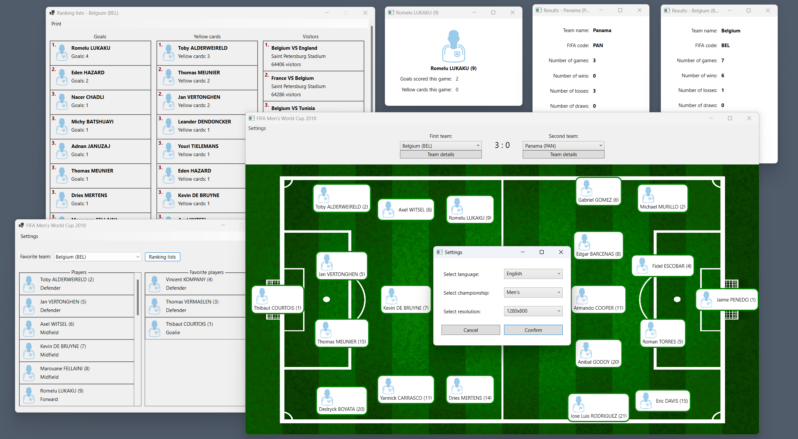

# FIFA World Cup

College project (OOP.NET S4): Two Windows apps with shared preferences, showcasing FIFA World Cup 2016 results. Built with .NET Core 6 using Windows Forms and Windows Presentation Foundation (WPF).

Open `OOP.NET.sln`.

- `WinFormsApp/` - Windows Forms
- `WpfApp/` - WPF
- `ClassLibrary/` - shared models/prefs
- `worldcup.sfg.io/` - local JSON cache

## Specs

- [specs-en.pdf](specs-en.pdf)
- [specs-hr.pdf](specs-hr.pdf)
